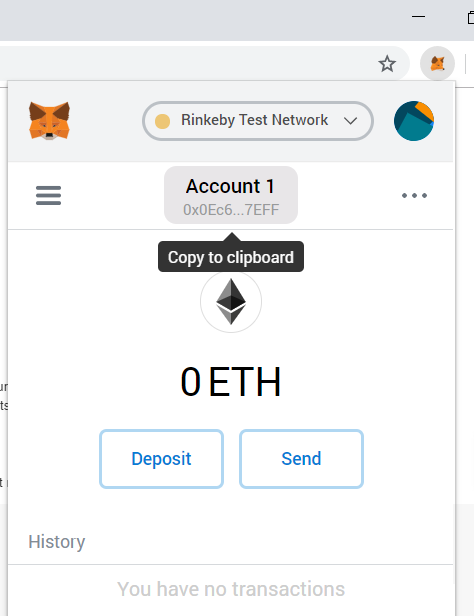
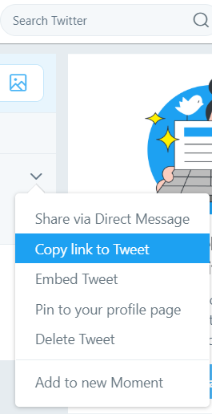

Module 10 - Intermediate Lab: Creating An ERC20 Token
=======================
# Background
Tokens can be created with blockchain technology through smart contracts on the Ethereum network. This lab creates a set of fungible tokens using a template Solidity smart contract which implements the ERC20 interface.

# Meta-information

| Attribute | Explanation |
| ------------- | ------------- |
| Summary | Create a basic token using smart contracts on an Ethereum test network. |
| Topics | Tokens, Solidity, blockchain development, and Ethereum. |
| Audience | Appropriate for CS1 or a later course. |
| Difficulty | Completing the assignment is easy, as it is just editing a contract and deploying it. However, full understanding and extension of the contract can be difficult. |
| Strengths | Allows students to get exposed to popular technology (blockchain, tokens/currencies, smart contracts) and provides a launch point for further token development. |
| Weaknesses | May be difficult for students to extend the smart contract; omits finer details of transactions in blockchain settings. | 
| Dependencies | Internet-connected computer with suitable browser (Chrome, Firefox, etc.) and access to the Remix IDE. |
| Variants | Could be used in an introductory course of OOP languages, as means to introduce how to implement a specification. |

# Assignment instructions (10 Minutes)

## Setting up your wallet and test Ethereum
1. Navigate to [MetaMask](https://metamask.io/) and install the extension for your browser (feel free to watch the introduction video, too).
2. Click the get started button and then click the create a wallet button.
3. Agree or decline the anonymous usage data collection.
4. Create a new, secure password. You can use [How Secure Is My Password](https://howsecureismypassword.net/) to check (be careful of similar services).
5. Enter and confirm your password in MetaMask, and click to acknowledge you agree to the Terms of Use (if you do). Then click create.
6. It is advisable to read the information on the next page and store your mnemonic phrase accordingly. Remember: this is for your eyes only, forever. It is all the information someone needs to someday steal all of the future value you may have in this wallet. And if you lose it, no-one can help you recover it.
7. Confirm you have your mnemonic phrase properly stored and accessible to you by clicking the words on the next page in the correct order. Then proceed, reading along the way, until you see your account balance. You should have 0 ETH ($0.00 USD).
8. In the top right, you should see a dropdown with 'Main Ethereum Network'. Click this and select 'Rinkeby Test Network'.
9. Click on the 'DEPOSIT' button to the right of your balance and in the overlay that appears, click 'GET ETHER' by Test Faucet.
10. A new tab should open at https://www.rinkeby.io/#stats. On the left border of this page, click the middle button labeled 'Crypto Faucet'.
11. For the next step, Twitter is recommended, but you may use any listed option which works for you. Follow the instructions on the page you are redirected to in order to get your wallet funded with test currency. (If using Twitter, be sure to use the link to the tweet itself which you pasted your wallet's public address into.)
    * Get your wallet address by clicking on the MetaMask icon in the top right of your browser and then clicking the account name to copy it to your clipboard (later, paste with Ctrl V).  
      
    
12. Wait until your account gets funded, checking your balance in MetaMask periodically.

## Editing the contract.sol file (note: this lab uses the older Remix layout)
1. Copy the contents of the [sample contract](contract.sol) and paste into a new file in [the Remix Solidity IDE](https://remix.ethereum.org/).

### Editing the comment block
This section will not affect the contract code. It is written to practice documentation and maintainance of code. 

| Line | Characters to change | Explanation |
| --- | --- | --- |
| 4 | [insert token name here] | One-word name for your token. You should use CamelCase, as per Solidity convention. |
| 6 | [insert wallet address to deploy here] | Your wallet address from your account in MetaMask. |
| 7 | [insert token symbol here] | Shorthand symbol to identify your token (example: "UHMC"). |
| 8 | [insert token name here] | One-word name for your token; same as above. |
| 9 | [insert total supply of tokens here] | Total number of tokens in existance. |
| 10 | [insert decimal denomination per token, up through 18] | Example given: 3 |

### Editing the contract constructor method

| Line | Characters to change | Explanation |
| --- | --- | --- |
| 107 | [TokenName] | One-Word name for your token; same as above. |
| 121 | [insert token symbol here] | Shorthand symbol to identify your token (example: "UHMC"); same as above. |
| 122 | [insert token name here] | One-word name for your token; same as above. |
| 123 | [insert token decimal denomination here] | Same as above. |
| 125 | [insert token supply here] | Write the token supply, read line 124 to learn how to do this. e.g. 100 & 3 -> 100000 |
| 126 | [insert your wallet address here] | Your wallet address from your account in MetaMask; same as above. |
| 127 | [insert your wallet address here] | Your wallet address from your account in MetaMask; same as above. |

## Deploying your contract to the Rinkeby testnet (note: this lab uses the older Remix layout)
1. After all the lines listed are edited, click on “Start to compile” on the top right corner of the Remix IDE.
2. After successful compilation, click on the 'Run' tab.
3. The four fields should already be filled out with:
    * Environment: Injected Web3 Rinkeby
    * Account: \[your wallet address\]
    * Gas limit: 3000000
    * Value 0 wei
4. In the next box, select the name of your coin in the dropdown, then click the 'Deploy' button.
5. If necessary, click on the MetaMask plugin icon in the top right of your browser, then click 'CONFIRM' in the popup to allow the transaction.
6. If all went well, you should now see your contract in the Deployed Contracts section in Remix. You may also find it by searching your wallet address on [Etherscan][rinkeby.etherscan.io] or navigating through the interface in the MetaMask plugin.
7. You can now interact with your contract by clicking the arrow on the left side of your deployed contract (in Remix) and then filling out the fields and clicking the buttons corresponding to methods in the contract. For example, clicking owner should return your wallet's address.
8. Try transferring tokens to someone else and have them transfer their created tokens to you; then verify the transactions on [Etherscan][rinkeby.etherscan.io].

# Credits
Dr. Debasis Bhattacharya  
Mario Canul  
Saxon Knight  
Assignment possible thanks to the work of [Moritz Neto](https://twitter.com/mrtzneto) for the original contract.  
Special thanks to [James Maupin](https://github.com/jmsMaupin1) for help with testing and feedback.  

[rinkeby.etherscan.io]: https://rinkeby.etherscan.io/
